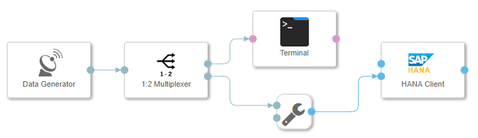
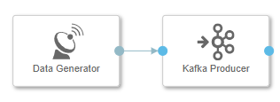
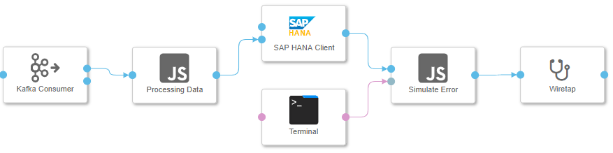
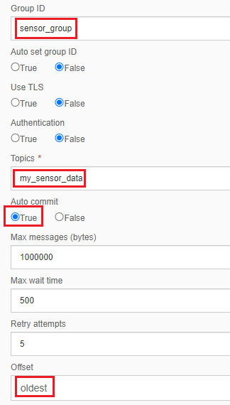
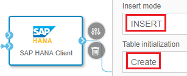
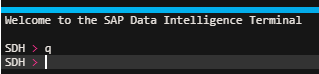
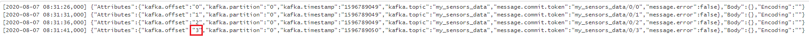
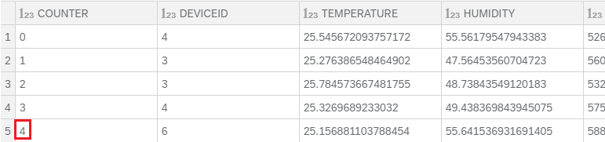
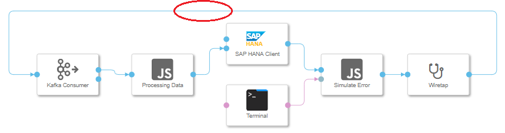
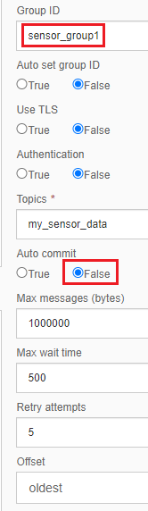

This blog will show you how to ingest stream(unbounded) data into SAP HANA in a fault-tolerant way using SAP Data Intelligence. We will start from a simple solution and improve it gradually until the processing meet the demand of our expectation. 

## 1. A simple data ingestion pipeline
The below figure shows a simple example pipeline provided by SAP Data Intelligence. The data generator produces sensor data as a CSV string message. The message is loaded into SAP HANA and in parallel sent to a terminal, which you can use to see the generated data.



It looks good if it is only for a demonstration purpose. However, in reality we cannot take the assumption that everything works just fine in a distributed environment. The pipeline execution might be dead if something unexpected occurred. For example, what if there is a temporal network partition and the HANA Client connection timeout? We need our pipeline executed in a fault-tolerant way. 

- The data generator should decouple from its consumers. And it should be able to continue generate messages regardless if the consumers failed or not. 
- Regardless of what caused the consumer failure and how long the failure lasts, it should be able to recover by picking up the data at the place where it left during the failure period instead of processing from the beginning. This will save the processing time.
- Losing data or duplicated processing data will casue the derived HANA database table go permanently out of sync with the data generator. Thus message delivery must be reliable. 

Next, we will look at how to improve the pipeline to address these issues.

## 2. Durable messages
To decouple the message producers from the message consumers, the data should be persisted somewhere.

A good choice is to use a Log-based message broker which retains messages on disk. Apache Kafka is a message broker which persists the messages it receives. It also maintains the last committed message offset.

Now we modfiy the graph to add Kafka into the pipeline. This time we want to place the message producer and the message consumer into two separate graphs as we do not want to stop the producer when the consumer graph failed.





For debug and testing purpose, I added more operators into the consumer graph:
- Message operator labeled as "Processing Data": A stream processor simply sleep some time to mimic a time-consuming message processing and forward the receiving message to downstream operator. Its processing code is as below:
```
function sleep(millisecondsToWait) {
  var now = new Date().getTime();
  while(new Date().getTime() < now + millisecondsToWait) {}
}

function onInput(ctx,s) {
    sleep(5000);
    $.output(s);
}

$.setPortCallback("input",onInput);
```
- "Terminal" operator: We will use it to send a signal indicating an unexpected error occured to the downstream operator.
- Message Operator labeled as "Simulate Error": It receieves message from HANA Client and forward it to downstream opeator. It also has a debug port used for receieving a terminal signal. After receieve the signal, the graph will be dead if it receieves a subsequent incoming message from HANA Client. Its code is as below:

```
var terminate = false;

function onInput(ctx,s) {
    if(terminate) {
        $.fail("unexpected value received");
    }
    $.output(s);
}

function onDebug(ctx, s) {
    terminate = true;
}

$.setPortCallback("input",onInput);
$.setPortCallback("debug",onDebug);
```
- Wiretap opeator simply trace the messages ingested into HANA.

Next we want to see what kind of message delivery guarantee the pipeline can provide with different configuration and settings.

## 3. Message delivery guarantee
Let's dig a little deeper on the message delivery guarantee and what it means to the applciaiton.

### 4.1. At most once delivery guarantee
Config Kafka consumer like the below figure:



Config Hana Client like below figure:



Run the graph. After a few moment, enter something into the terminal window like below to signal the termination of the pipeline execution. 



After the pipeline dead, observe the output of the wiretap operator like below:



Check the HANA Database table to verify the ingested data:



Note that the two offsets are not exactly the same thing:
- The offset in Wiretap is an offset Kafka assgined to each message which is a monotonically increasing sequence number.
- The offset (the counter variable) in HANA table is actually a field we added when the data generator generates every message. It is also a monotonically increasing sequence number like below code:
```
// This operator is needed to keep compatibility to the old datagenerator
var counter = 0;

getRandom = function(min, max) {
    return Math.random() * (max - min) + min;
};

getRandomInt = function(min, max) {
    return Math.floor(Math.random() * (max - min + 1)) + min;
};

generateData = function() {

    // payload = "3,26.4,60.9,532.0,1.0,24.0,55.0,0,657.0,437.0,1388,5,-33,3.33"

    var payload = getRandomInt(2, 6) + ","; // DeviceID
    payload += getRandom(25, 26) + ","; // Temperatur
    payload += getRandom(40, 60) + ","; // Humidity
    payload += getRandom(500, 600) + ","; // CO2    
    payload += getRandom(0.9, 1.1) + ","; // CO    
    payload += getRandom(23, 25) + ","; // LPG    
    payload += getRandom(50, 60) + ","; // Smoke  
    payload += getRandomInt(0, 1) + ","; // Presence 
    payload += getRandom(600, 800) + ","; // Light  
    payload += getRandom(400, 500) + "\r\n"; // Sound  

    return payload;
};

$.addTimer("500ms",doTick);

function doTick(ctx) {
    $.output(counter+","+generateData());
    counter++;
}

```
> Although these two offsets are not the same thing, they are actually equivalent since the generated messages are sent to the same Kafka partition in an append-only fashion. The reason why they show different values is that when the pipeline failed, the upstream message in HANA has not sent to the wiretap operator yet.

Now restart the faild graph, repeat above process and observe the result.

To save space, I record the output offset ranges in below table(I will not list wiretap output since it is not relevant for the later discussion):

Run | HANA Table
---|---|---
first | 0 - 4
second | 8 - 11

From this table, we can see that some messges are lost between the two run. HANA table lose messges at offset 5, 6, and 7. In this case, we say the pipeline only processing message at most once when recoverd from error. This is not a fault-tolerant stream processing.

Now let's see if we can improve this guarantee.

### 4.2. At least once delivery guarantee
From the above discussion, we can see the reason why there is message lose in the HANA table is that the message offset picked in the second run is not correct. The commited offset of the Kafka consumer did not reflect the actual position HANA table consumed.

To fix this problem, the HANA Client operator needs to explicitly tell Kafka when it has finished processing a message. Without Kafka receiving an acknowledgment, the message offset in that partition will not get committed. This effectively keep the committed offset of the Kafka topic partition in sync with HANA table message consumption.

Fortunately, we can implement this simply by connecting the "SAP HANA Client" operator with the "Kafka consumer operator" like the below figure illustrated:



Also, change the Kafka consumer operator configuration like below:



We changed the "Auto Commit" option from "True" to "False".

> Note that "Group ID" configuration also has been changed, this actually make the consumer a brand new consumer for the same topic partition. Thus, the commited offset for this new comsumer is at the beginning of the partition. This is a huge benefit Kafka provides since we can testing new idea very eaisly simply by adding a new consumer.

Now repeat the same steps like we did before. I record the output offset ranges in below table:
Run | HANA Table
---|---|---
first | 0 - 5
second | 5 - 9

We can see that HANA table this time did not lose any messages. But the message at offset 5 was processed twice. In this case, we say the pipeline processing message at least once when recoverd from error. This is not a fault-tolerant stream processing as well since duplicated message processing may cause data corruption in some cases. For example, in the data integration scenario I mentioned in [blog](https://blogs.sap.com/2020/06/15/buid-log-based-integration-with-sap-data-intelligence/), if the derived systems processing message twice may cause the source system and derive systems permanently inconsistent.

This duplicated message processing is caused by the message which has not been acknowledged by Kafka when the failure happend. Thus, Kafka will not commit that offset. When the graph restart, the message will be sent again.

Next, we will discuss ways to do duplicate suppression.

### 4.3. Exactly once delivery guarantee