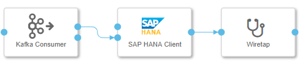

This blog will show you how to ingest streaming(unbounded) data into SAP HANA in a fault-tolerant way with SAP Data Intelligence. We will start from a simple solution and gradually improve it until done. 

## 1. A simple data ingestion pipeline
The below figure shows a simple example pipeline provided by SAP Data Intelligence. The data generator produces sensor data as a CSV string. The data is loaded into SAP HANA and in parallel sent to a terminal, which you can use to see the generated data.


Everything looks good. But what if the graph failed for some unexpected reason? We can not just blindly take the assumption that everythings works fine in a distributed environment. For example, what if there is a temporal network partition which cause the connection to HANA database timeout? The pipeline obviously will be dead. In real world, the sensor and the HANA database usually are separate compoents not coupled together like this example which means the sensor still emitting the data regardless of the failed pipeline. Are all these newly emitted data get lost? There are a lot of questions come to mind. We will look how to improve the pipeline to address those issues.

## 2. Durable messages
The first step is to decouple the message producer from the message consumer. The failed consumer should not effect the producer. The producer will continually emitting data even the consumer failed for whatever reason. Thus, the data should be persisted somewhere for consumers to ingest when they get recoverd some time later.

A good choice is to use a Log-based message broker which retains messages on disk. Apache Kafka is a message broker which persists the messages it receives. It provides a total ordering of the messages inside each partition. It also maintaits the last committed message offset.

Now we modfiy the graph to add Kafka into the pipline. This time we want to separate the message producer and the message consumer into two different graphs as we do not want to stop the producer when the consumer graph failed.




> I also changed the terminal operator to wiretap operator which shows more message information.

Now, by incorporating Kafka into our pipeline, we are flexbilbe enough to debug and test our pipeline.

## 3. Produce sensor data
Run the producer graph for a while, then stop it. The generated messages will be retained in Kafka. We stop its running because we do not want to run it indefinitely which will waste the kafka broker resource. The generated data is enough for our testing purpose. 

## 4. Message delivery guarantee
Now we want to see the message delivery guarantee the pipeline can provide using different configurations.

Add more operators into the pipeline like below.


- "Wiretap 1" traces the output messages from Kafka directly.
- "Message Operator" handles the receieved message and send the result to the downstream operator. It also has a debug port used for receieving a terminal signal.
- "Wiretap 2" traces the outout messages ingested into HANA.
- "Terminal" operator sends a signal to "Message Operator" to indicate the graph termination.

> The debug port of "Message Operator" is for acceptting an input from the terminal operator, upon receieve the input, the "Message Operator" will terminte its execution and finally cause the graph dead. This is to simulate an error occur in the pipeline execution.   

The script code for the "Message Operator" like below:
```
var terminate = false;

function sleep(millisecondsToWait) {
  var now = new Date().getTime();
  while(new Date().getTime() < now + millisecondsToWait) {}
}


function onInput(ctx,s) {
    if(terminate) {
        $.fail("unexpected value received");
    }
    sleep(5000);
    $.output(s);
}

function onDebug(ctx, s) {
    terminate = true;
}

$.setPortCallback("input",onInput);
$.setPortCallback("debug",onDebug);
```

In the following setctions, we will use the different configuration to see different Message delivery guarantee.

### 4.1. At most once delivery guarantee
Config Kafka consumer like the below figure:


Run the graph. Observe the output of the twp wiretap operators. After a few moment, enter something into the terminal window like below to simulate the pipeline runing fail. 


"Wiretap 1" output like below:


"Wiretap 2" output like below:


Now restart the faild graph, and run it for a while. 

To save space, I record the offset ranges of the two wiretap outputs in below table:

run | Wiretap 1 | Wiretap 2 
---|---|---
first |0 - 12 | 0 - 10
second |15 - 27 | 15 -25

From this table, we can see that some messges are lost between the two run. "Wiretap 1" lose messages at offset 13 and 14. "Wiretap 2" lose messges at offset 11, 12, 13, and 14. For this kind of recovery processing, we say the pipeline only processing message at most once in case of recovered from fail. The reason why messages are lost is because the HANA database processing messgaes lag behind the message at the committed offset of the Kafka topic partition. 

Now let's see if we can improve this guarantee.

### 4.2. At least once delivery guarantee
To avoid message lost, we need to keep the HANA database message consumption in sync with the committed offset of the Kafka topic partition.

Fortunately, Kafka consumer operator allows this synchronization by connecting the sink output port with input port of the Kafka consumer operator. Like the below figure illustrated:


Also, change the Kafka consumer operator configuration like below:


> Note that "Group ID" configuration has been changed, this actually make the consumer a brand new consumer for the same topic partition. Thus, the commited offset for this new comsumer is at the begin of the partition. This is a huge benefit Kafka provides since we can testing new idea very eaisly simply by adding a new consumer.

Now repeat the same steps like we did before. I record the offset ranges of the two wiretap outputs in below table:
run | Wiretap 1 | Wiretap 2 
---|---|---
first |0 - 9 | 0 - 7
second |7 - 14 | 7 - 12

We can see "Wiretap 2" this time did not lost any messages. Instead, it processes the message at offset 7 twice. We can verify this by checking the HANA databse table like below:

