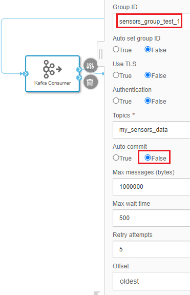

This blog will show you how to ingest stream(unbounded) data into SAP HANA in a fault-tolerant way using SAP Data Intelligence. We will start from a simple solution and improve it gradually until the processing meets the demand of our expectation. 

## 1. A simple data ingestion pipeline
The below figure shows a simple example pipeline graph provided by SAP Data Intelligence. The datagenerator produces sensor data as a CSV string message. The message is loaded into SAP HANA and in parallel sent to a terminal, which you can use to see the generated data.


It looks good if it is only for a demonstration purpose. However, in reality we cannot take the assumption that everything works just fine in a distributed environment. The pipeline execution might be dead if something unexpected occurred. For example, what if there is a temporal network partition and the HANA Client connection timeout? We need our pipeline executed in a fault-tolerant way：

- The data generator should decouple from its consumers. And it should be able to continue generate messages regardless if the consumers failed or not. 
- Regardless of what caused the consumer failure and how long the failure lasts, it should be able to recover by picking up the data at the place where it left during the failure period instead of processing from the beginning. This will save the processing time.
- Losing data or duplicated processing data will casue the derived HANA database table go permanently out of sync with the data generator. Thus message delivery must be reliable. 

Next, we will look at how to improve the pipeline to address these issues.

## 2. Durable messages
To decouple the message producers from the message consumers, the data should be persisted somewhere.

A good choice is to use a Log-based message broker which retains messages on disk. Apache Kafka is a message broker which persists the messages it receives. It also maintains the last committed message offset for each consumer.

Now we modfiy the graph to add Kafka into the pipeline. This time we want to place the message producer and the message consumer into two separate graphs as we do not want to stop the producer when the consumer graph failed.


Now we can start the producer graph to generate messages.


For debug and testing purpose, I added more operators into the consumer graph:
- "Processing Data" operator: A stream processor simply sleeps some time to simulate a time-consuming message processing and forwards the receiving message to downstream operator. Its processing script code is as below:
```
function sleep(millisecondsToWait) {
  var now = new Date().getTime();
  while(new Date().getTime() < now + millisecondsToWait) {}
}

function onInput(ctx,s) {
    sleep(5000);
    $.output(s);
}

$.setPortCallback("input",onInput);
```
- "Terminal" operator: We will use it to send a signal indicating an unexpected error occured to the downstream operator.
- "Simulate Error" operator: It receieves message from HANA Client and forwards it to downstream opeator. It also has a debug port used for receieving a terminal signal. After receieving the signal, the graph will be dead if it subsequently receieves an incoming message from HANA Client. Its script code is as below:

```
var terminate = false;

function onInput(ctx,s) {
    if(terminate) {
        $.fail("unexpected value received");
    }
    $.output(s);
}

function onDebug(ctx, s) {
    terminate = true;
}

$.setPortCallback("input",onInput);
$.setPortCallback("debug",onDebug);
```
- "Wiretap" opeator: It simply traces the messages ingested into HANA database table.

Next we want to see what kind of fault-tolerant message delivery guarantees the pipeline can provide and their implication on maintaining the integrity of a data system in the face of faults.

## 3. Message delivery guarantee
Let's try different configurations and settings.

### 3.1. At most once delivery guarantee
Configure "Kafka consumer" operator like the below figure illustrated:


Configure "SAP Hana Client" operator like below figure illustrated:


Run the graph. After a few moment, enter something into the terminal window like below to send a termination signal to the downstream operator: 


After the pipeline graph dead, check the HANA Database table to verify the ingested data:


We can see there are five messages succesfuly ingested. The COUNTER field indicating the message offset the "Data Generator" prepend to each message. It is a monotonically increasing sequence number. It is very useful we will see in later section.

Now try to recover the pipeline execution by restating the graph and repeat above steps and observe the result.

To save space, I record the output offset ranges for each run in below table:

Run | HANA Table
---|---
first | 0 - 4
second | 8 - 11

From this table, we can see that some messges are lost between the two run. HANA table lose messges at offset 5, 6, and 7. In this case, we say the pipeline only processing each message at most once. This is not a fault-tolerant stream processing.

Now let's see if we can improve this guarantee.

### 3.2. At least once delivery guarantee
From the above discussion, we can see the reason for the message lost is that the message offset picked in the second run is not correct. The commited offset of the Kafka consumer did not reflect the actual offset position HANA table consumed.

To fix this problem, the "SAP HANA Client" operator needs to explicitly tell Kafka when it has finished processing a message. Without Kafka receiving an acknowledgment, the message offset in the Kafka topic partition will not get committed. This effectively keeps the committed offset of the Kafka topic partition in sync with HANA table message consumption offset.

Fortunately, we can implement this simply by connecting the output the "Wiretap" operator to the input port of the "Kafka Consumer operator" like the below figure illustrated:


Also, change the "Kafka Consumer" operator configuration like below:



We changed the "Auto Commit" option from "True" to "False".

> Note that "Group ID" configuration also has been changed, this actually makes the consumer a brand new consumer for the same Kafka topic partition. Thus, the committed offset for this new consumer is at the beginning of the partition. This is a huge benefit Kafka provides since we can testing new idea very eaisly by adding a new consumer.

Now repeat the same steps like we did before. I record the output offset ranges in the below table:
Run | HANA Table
---|---
first | 0 - 5
second | 5 - 9

We can see this time the HANA table did not lose any message. But the message at offset 5 was processed twice. In this case, we say the pipeline processing every message at least once. This is not a fault-tolerant stream processing as well since duplicated message processing may cause data corruption in some cases. For example, in the data integration scenario I mentioned in [blog](https://blogs.sap.com/2020/06/15/buid-log-based-integration-with-sap-data-intelligence/), if the derived systems processing message twice which may cause the source system and the derive systems permanently inconsistent.

This duplicated message processing is caused by the message which has not been acknowledged by Kafka when the failure happend. When the graph restart, the unacknowledged message will be sent again.

Next, we will discuss how to improve this guarantee by doing duplicate suppression.

### 3.3. Exactly once delivery guarantee
An effective approache is to make the operation **idempotent** to ensure that it has the same effect, no matter whether it is executed once or multiple times. Solving the problem requires an end-to-end solution: we need an operation identifier that is passed all the way from the producer to the database.

In our case, we do not want the message as offset 5 inserted into the HANA table twice. Thus, we need to make the insert operation idempotent. 

One solution is to change the insert mode of the HANA Client to “UPSERT” and for that create primary keys on the HANA table. Now the question is how to choose or generate an identifier as the primary key for that table.

Recall that we mentioned above that the message has a field named COUNTER which is a monotonically increasing sequence number. It actually uniquely identifies a message. So it is a natural fit for primary key in this case.

Now let's try to implement the idea by taking the following steps:
1. Drop the existing HANA table and create a new table with below SQL statment and declare the counter as primary key:

```
CREATE TABLE "ANDYTEST"."sensorData"(counter INTEGER, deviceid INTEGER, temperature DOUBLE, humidity DOUBLE, co2 DOUBLE, co DOUBLE, lpg DOUBLE, smoke DOUBLE, presence INTEGER, light DOUBLE, sound DOUBLE, PRIMARY KEY (counter));
```

2. Change the "Kafka Consumer" operator configuration like below:


3. Change the "SAP HANA Client" operator configuration like below:


4. Run the same steps like we did before. 

I record the output offset ranges in below table:
Run | HANA Table
---|---
first | 0 - 5
second | 6 - 9

Wow, we can see that this time the messages are processed exactly once!

## 4. Summary
We have seen scenarios in which a message is lost, a message takes effect twice and a message takes effect exactly-once. This proves that fault-tolerant message delivery and duplicate suppression are important for
maintaining the integrity of a data system in the face of faults. Hope this will provide some inspiration on the design of a fault-tolerant stream processing pipeline in SAP Data Intelligence.